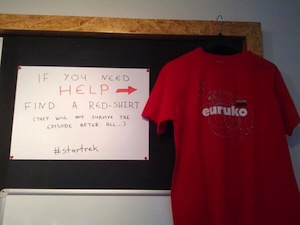

# Off the rails and behind the scenes

Not all Ruby projects are Rails projects just as not all software projects are web or mobile apps.
In fact software is all around us, it helps warm, feed, transport and even cure us. 

And the majority of the software that does this is not written in some fancy new dynamic language or some (re)discovered functional paradigm, it's written in good old bad C or C++, warts and all. 

Does Ruby fit in this world? Can we find solace in a C++ desert? Is the actor model a summer night's dream and REST interfaces an unattainable dream?

Audience not distracted by funny pictures will gain insight on how Ruby can be put to good use behind the scenes at almost every software project even if that means working on Windows.

## Vassilis Rizopoulos

Vassilis works at [Zühlke](http://www.zuehlke.com), introducing Ruby and the joys of devops to industry giants like Siemens, Lenze, Roche or Liebherr. 

He's one of the redshirt survivors of EuRuKo 2013 and co-founder of [thessaloniki.rb](https://github.com/thessaloniki/rb) and has been pretending - somewhat successfully - to be an embedded software developer for over a dozen years now.

Working in Ruby since late 2001 he has long claimed the title of eldest Ruby programmer that has never written a production Rails app. That is, he has been claiming this up until the point Matz corrected him by claiming the title for himself. Now he just hangs his head in shame.

- [Blog](http://www.ampelofilosofies.gr)
- [Twitter](https://twitter.com/#!/arcandros)
- [Github](https://github.com/damphyr)
